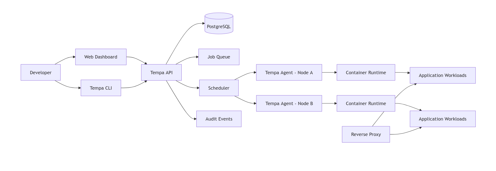

# Tempa

> Self-hosted platform for building, deploying, and running applications.

Tempa is an experimental **self-hosted Platform as a Service (PaaS)** and **Internal Developer Platform (IDP)** built as a personal engineering project.

The project aims to provide a simple deployment experience similar to platforms such as Vercel and Coolify while retaining full control over the infrastructure, runtime, networking, and application lifecycle.

```bash
tempa deploy
```

> [!WARNING]
> Tempa is under active development and is not ready for production use.

## Why Tempa?

Running applications on personal or internal infrastructure often requires manually configuring builds, containers, environment variables, domains, reverse proxies, TLS certificates, databases, and deployment history.

Tempa aims to combine those responsibilities behind one consistent platform:

1. Connect or define an application.
2. Configure its build and runtime.
3. Deploy it to a registered server.
4. Expose it through a domain with HTTPS.
5. Observe and manage its lifecycle from one place.

## Project Goals

* Provide a fast and repeatable deployment workflow.
* Keep the platform fully self-hosted.
* Use explicit and understandable infrastructure abstractions.
* Support applications, services, and managed resources through one control plane.
* Separate platform orchestration from low-level container runtime operations.
* Build a strong foundation before adding broad provider integrations.
* Explore distributed systems, orchestration, and platform engineering in practice.

## Planned Capabilities

### Applications

* Deploy applications from Git repositories.
* Deploy prebuilt container images.
* Deploy Docker Compose workloads.
* Configure build and start commands.
* Manage environment variables and secrets.
* View build, deployment, and runtime logs.
* Roll back to previous deployments.
* Restart, stop, redeploy, and remove applications.

### Networking

* Assign custom domains.
* Route traffic through a reverse proxy.
* Provision and renew TLS certificates.
* Perform application health checks.
* Support internal service-to-service networking.

### Data and Services

* Provision managed databases.
* Attach persistent storage volumes.
* Create scheduled backup jobs.
* Manage reusable services such as PostgreSQL, Redis, and object storage.

### Infrastructure

* Register and manage deployment servers.
* Track server capacity and health.
* Schedule workloads onto eligible servers.
* Support multiple runtime drivers through a stable interface.
* Start with a `ContainerdRuntimeDriver`.

### Developer Experience

* Web dashboard.
* CLI-oriented workflows.
* Deployment history and audit events.
* Consistent application and resource status models.
* Clear error reporting during build and deployment operations.

## High-Level Architecture

Tempa is designed around a **control plane** and one or more **execution nodes**.



### Control Plane

The control plane stores and manages the desired state of the platform:

* Users, workspaces, and projects.
* Applications and services.
* Deployment specifications.
* Domains and certificates.
* Server registration and capacity.
* Deployment jobs and lifecycle states.
* Audit events and operational metadata.

### Execution Agent

Each managed server runs a Tempa agent responsible for translating control-plane instructions into runtime operations:

* Pulling source code or container images.
* Executing build steps.
* Creating containers and networks.
* Mounting persistent volumes.
* Reporting logs, health, and resource usage.
* Reconciling actual state with desired state.

### Runtime Driver

Runtime-specific operations are placed behind a driver interface. This prevents the application layer from depending directly on containerd implementation details.

The initial implementation is planned around:

```text
RuntimeDriver
└── ContainerdRuntimeDriver
```

Additional runtime drivers can be introduced without changing the core deployment model.

## Technology Stack

### Backend

* **Rust**
* HTTP and WebSocket API
* Background job processing
* PostgreSQL persistence
* Domain-driven modules with explicit infrastructure adapters

### Frontend

* **React**
* **TanStack Router**
* **TanStack Query**
* Type-safe API client
* Real-time deployment and log updates

### Infrastructure

* **PostgreSQL** for durable platform state
* **containerd** as the initial container runtime
* Reverse proxy for HTTP routing and TLS termination
* Linux-based execution nodes

Supporting technologies may evolve as the implementation is validated.